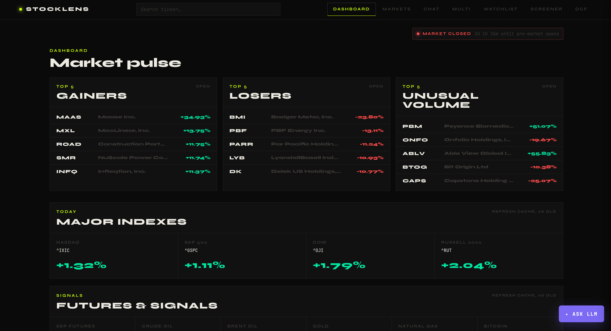
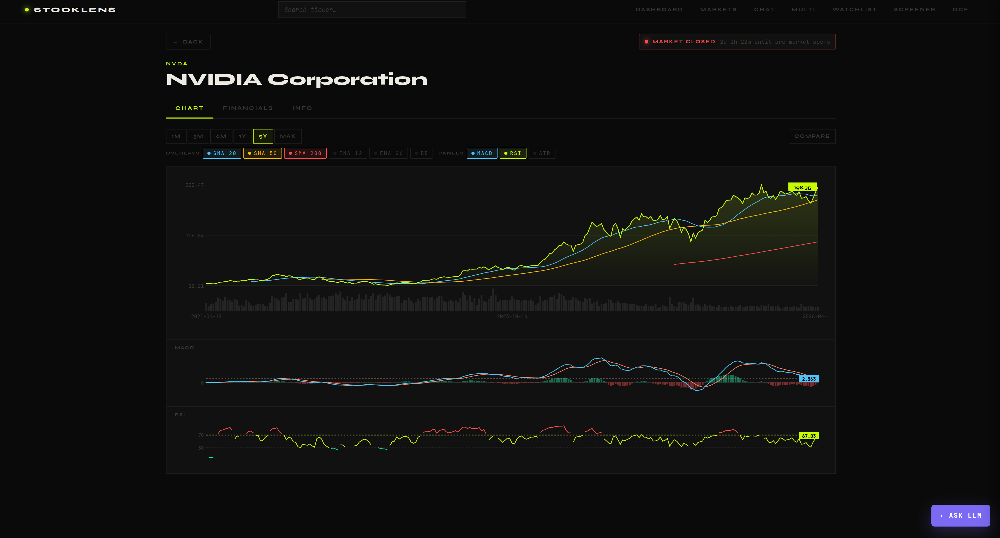
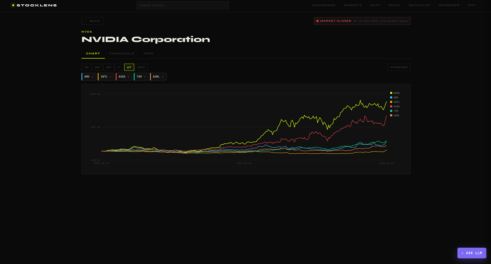
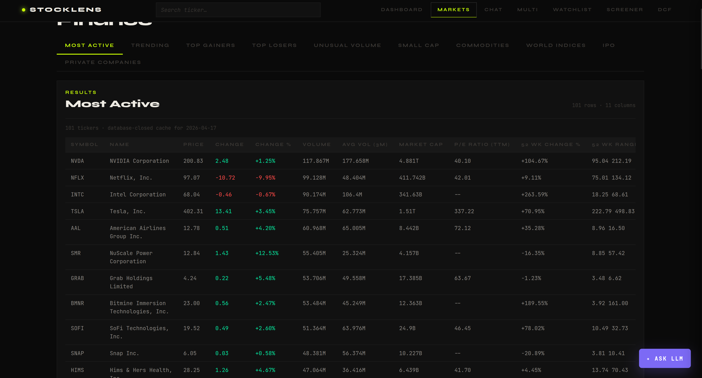
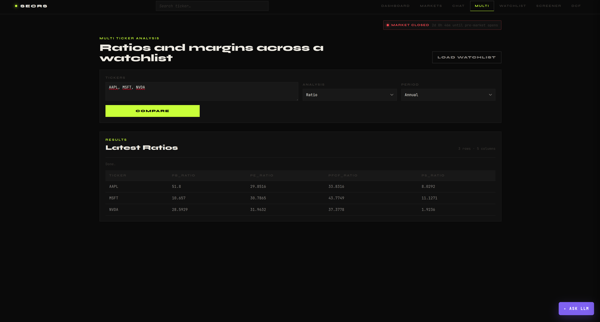
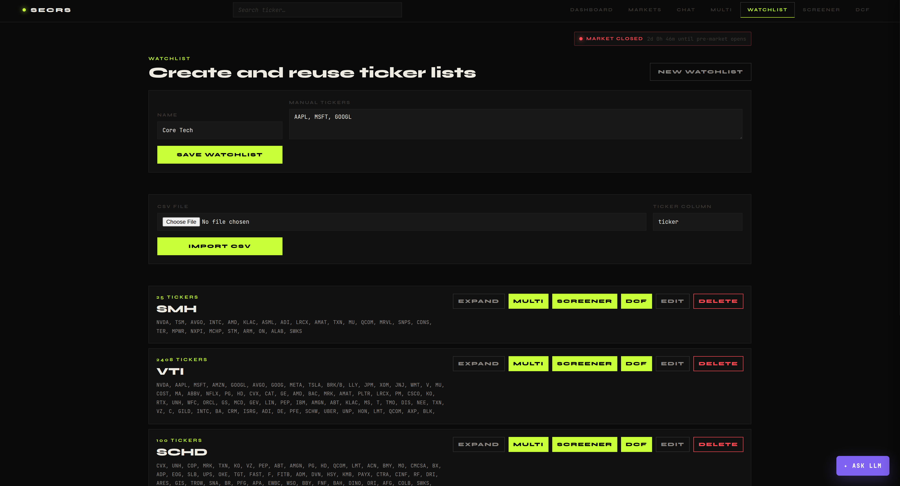
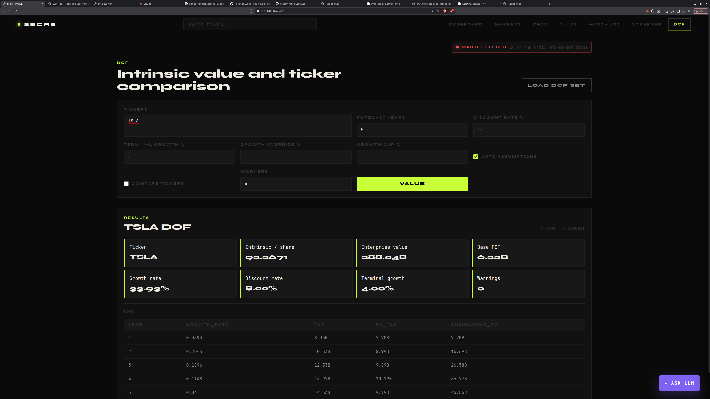
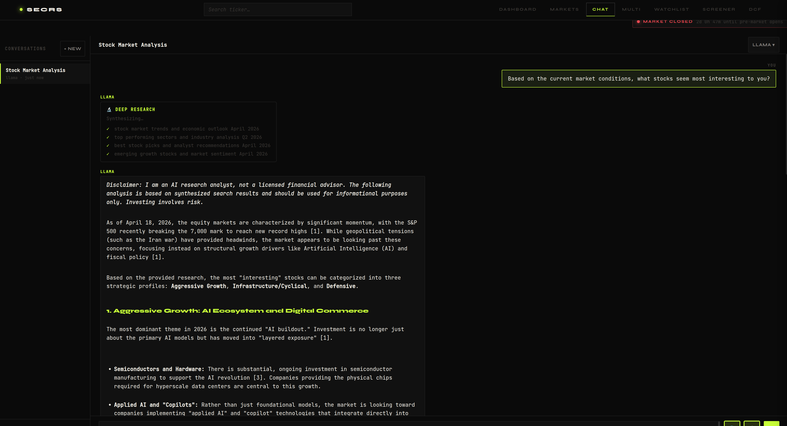
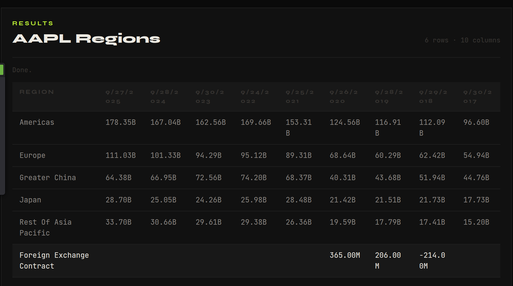

# StockLens

StockLens is a local web interface for researching public companies with SEC
EDGAR fundamentals, market data, charts, watchlists, screeners, DCF valuation,
and optional LLM-assisted analysis.

The UI is a standalone vanilla JavaScript single-page app served by a small
Python HTTP server. The data layer uses the `secrs` Python package for SEC
filings and financial statement data.



## Features

- Dashboard with market pulse cards, indexes, futures, and quick market views.
- Ticker search backed by SEC company ticker data.
- Ticker pages with price charts, technical indicators, comparison overlays,
  financial statements, revenue by region, and company information.
- Market movers pages for active, gainers, losers, trending, IPOs, and related
  market tables.
- Multi-ticker ratio and margin comparison.
- Watchlists stored locally in the browser, with manual entry and CSV import.
- Fundamental screener for filtering ticker lists by metrics.
- DCF valuation for single tickers and ticker comparisons.
- Chat workspace with Claude, OpenAI, or local llama.cpp-compatible backends,
  plus optional web search and deep research mode.

## Requirements

- Python 3.12 or newer
- `uv`
- Network access for SEC EDGAR, market data, and optional web search or LLM APIs

Install dependencies:

```bash
uv pip install -r requirements.txt
```

## Run The UI

From the repository root:

```bash
uv run -m ui
```

Then open:

```text
http://127.0.0.1:8765
```

You can also run the included helper:

```bash
./run.sh
```

If `uv run -m ui` reports `No module named ui`, make sure the command is being
run from this repository, not from another checkout or virtual environment:

```bash
cd /mnt/machine_learning/Coding/python/WebInterface/StockLens
uv run -m ui
```

## Pages

### Dashboard

The dashboard is the default landing view. It summarizes market activity,
indexes, futures, and links into detailed market tables.

### Ticker Pages

Use the global search bar to open `/ticker/<SYMBOL>`. Each ticker page includes:

- Chart: price history, volume, range controls, overlays, subchart indicators,
  and ticker comparison.
- Financials: income statement, balance sheet, cash flow, and regional revenue.
- Info: company profile and metadata when available.





### Markets

The markets page displays cached server-side market tables, including most
active stocks and other market categories.



### Multi

Compare ratios or margins for a list of tickers.



### Watchlist

Create browser-local watchlists from manual ticker entry or CSV upload. Saved
watchlists can be sent into Multi, Screener, or DCF workflows.



### Screener

Filter a ticker universe by fundamental metrics. Screener metric options are
loaded from the server.

### DCF

Run single-ticker intrinsic value analysis or compare valuation output across
multiple tickers.



### Chat

The chat page supports multiple providers and can use the currently visible UI
context when answering questions.



### Regional Revenue

Get regional revenue for a company.



## Configuration

Optional LLM providers are configured with environment variables:

```bash
export SECRS_CLAUDE_API_KEY="..."
export SECRS_OPENAI_API_KEY="..."
```

The local llama.cpp-compatible backend can be configured inside the UI settings.
By default the UI expects:

```text
http://localhost:8080
```

The underlying `secrs` package may also use its own data and cache configuration
environment variables. Keep those names unchanged; they refer to the Python
package, not the visual StockLens brand.

## Project Layout

```text
ui/
  __main__.py          Entry point for `uv run -m ui`
  server.py           Python ThreadingHTTPServer and API routes
  static/
    index.html        Single-page app shell
    app.js            Routing, rendering, charts, chat, and UI behavior
    styles.css        Dark terminal-inspired styling

assets/screenshots/   README screenshots
requirements.txt      Runtime dependencies
run.sh                Convenience launcher
```

## Data Notes

- SEC financial data is fetched through the `secrs` package.
- Ticker autocomplete uses SEC company ticker data and caches it locally.
- Candle data is served through the app's candle endpoint and trimmed by period.
- Some endpoints fetch live data; first runs may be slower while caches warm.
- Browser watchlists and chat settings are stored in `localStorage`.

## Development Notes

The web interface intentionally has no frontend build step. Edit the files under
`ui/static/`, restart the server if backend code changed, and refresh the
browser.

```bash
uv run -m ui --port 8765
```
